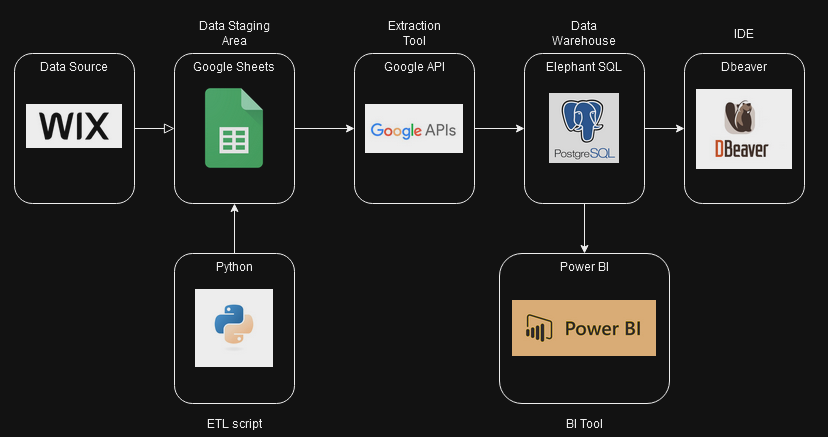

# Cloud ETL Traffic Data Pipeline

## Project Overview

This project contains an ETL pipeline developed to migrate web traffic analytics data from wix to a PostgreSQL database. The pipeline is designed to extract data from google sheets, transform it according to the required schema, and load it into a postgreSQL database hosted on ElephantSQL (cloud based database service). It automates the process of data handling in order to seamlessly analyze traffic data for insightful decision making.

## Features
- **Data Extraction**: Fetches data from Google Sheets, utilizing the Google Sheets API.
- **Data Transformation**: Converts and prepares the data for database insertion, ensuring compatibility with the PostgreSQL schema.
- **Data Loading**: Inserts the transformed data into a PostgreSQL database, managing data integrity and consistency.

## Tools/Languages
- **Python**: The primary programming language used for scripting the ETL process.
- **Pandas**: A Python library for data manipulation and analysis, utilized for transforming the data.
- **SQLAlchemy**: A Python SQL toolkit and Object-Relational Mapping (ORM) library used for database interactions.
- **PostgreSQL**: An open-source object-relational database system, chosen for its robustness and scalability.
- **ElephantSQL**: A cloud-hosted PostgreSQL service that provides the database backend.
- **Google Sheets API**: Used for extracting data from Google Sheets.
- **GitHub**: For version control and sharing the project publicly.

## Project files
[**sheets_to_sql.py**](sheets_to_sql.py) : ETL script
[**config.yaml**](config.yaml) : Configuration File for ETL Process. Contains settings and parameters for database connections, API credentials, file paths, and other operational specifications used by the ETL script.

## Schema
**Staging Table**:
| Column Name           | Data Type       | Description                |
|-----------------------|-----------------|----------------------------|
| id                    | SERIAL          | Primary Key                |
| Day                   | DATE            | Date of visit              |
| Visitor_Type          | VARCHAR(50)     | Type of the visitor        |
| Site_Member           | BOOLEAN         | Whether a site member      |
| Traffic_Category      | VARCHAR(50)     | Category of the traffic    |
| Traffic_Source        | VARCHAR(50)     | Source of the traffic      |
| Traffic_Source_URL    | TEXT            | URL of the traffic source  |
| Page_Path             | TEXT            | Path of the visited page   |
| Page_URL              | TEXT            | URL of the visited page    |
| Country               | VARCHAR(50)     | Visitor's country          |
| Device_Type           | VARCHAR(50)     | Type of device used        |
| Page_Views            | INT             | Number of page views       |
| Site_Sessions         | INT             | Number of site sessions    |
| Unique_Visitors       | INT             | Number of unique visitors  |
| Bounce_Rate           | VARCHAR(10)     | Bounce rate                |
| Avg_Session_Duration  | VARCHAR(10)     | Average session duration   |
| Avg_Time_On_Page      | VARCHAR(10)     | Average time on a page     |
| Avg_Pages_Per_Session | INT             | Average pages per session  |

## Setup and Usages
coming soon. 
